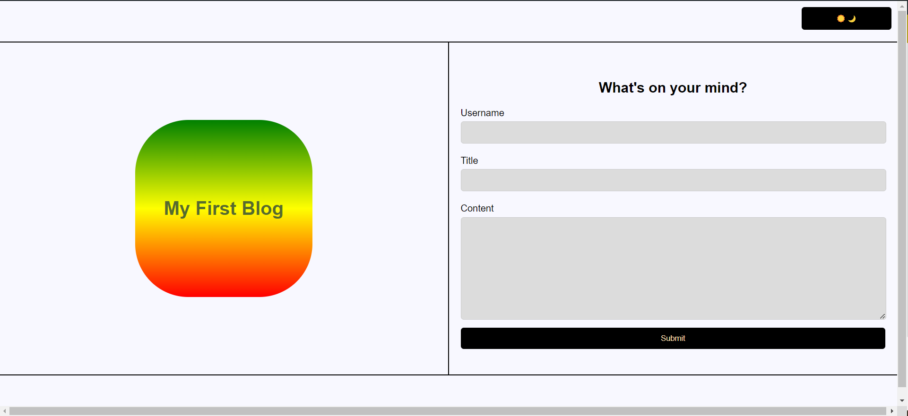
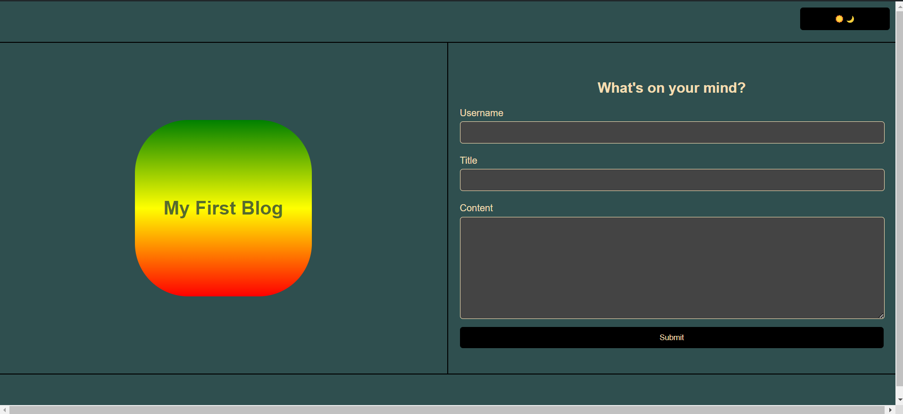
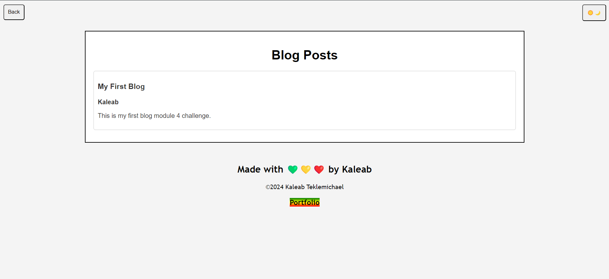
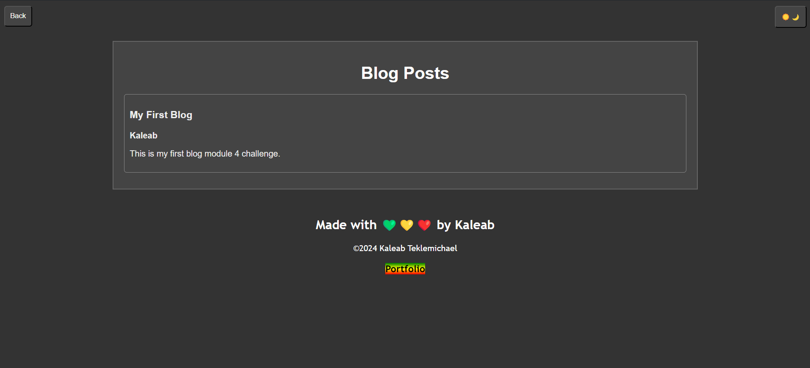

# Kaleab-Blog
This Blog entry website is used to entre and record blogs by different users and saves it on the local storage.
It also has a few extra functionalities to make the website more easy to use.
It takes an input from users and stores it on the local storage for later retrieval.
It has a toggle to switch between dark-mode and light-mode and stores the modes on the local storage.
It links my portfolio website

Enjoy

💚💛❤️

Kaleab Teklemichael
